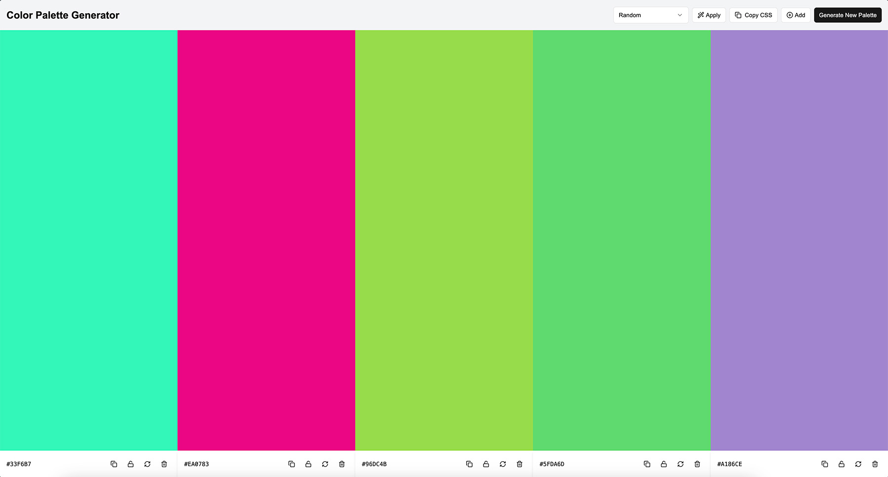

# palettes.defeo.io — Color Palette Generator

A fast, elegant color palette generator for designers and developers. Pick, tweak, and copy colors with ease.

**Live site**: [palettes.defeo.io](https://palettes.defeo.io)  
**Repo**: [github.com/mdefeo/palettes.defeo.io](https://github.com/mdefeo/palettes.defeo.io)



---

## Features

- Generate beautiful color palettes in seconds
- Palette generation based on color theory
- Manual locking and adjusting individual colors
- One-click CSS copy

---

## Getting Started

### 1. Clone the repository

```bash
git clone https://github.com/mdefeo/palettes.defeo.io.git
cd palettes.defeo.io
```

### 2. Install dependencies

```bash
pnpm install
```

Or use npm install or yarn install if preferred.

### 3. Run locally

```bash
pnpm dev
```

Open [http://localhost:3000](http://localhost:3000) in your browser to see the app.

### Built With

- Next.js
- Tailwind CSS
- TypeScript
- Lucide Icons

### Design Goals & Inspiration

- Lightning-fast interaction
- Minimal UI with maximum function
- Built with designers in mind, usable by devs
- Built for speed and simplicity — ideal for rapid prototyping and color experimentation. Inspired by tools like Coolors but optimized for keyboard use and design iteration

### Deployment

This project is automatically deployed to Vercel.

Visit [http://localhost:3000](http://localhost:3000) to view it in the browser.

### License

[MIT](./LICENSE)

### Author

Marcello De Feo
[defeo.io](https://defeo.io/)
